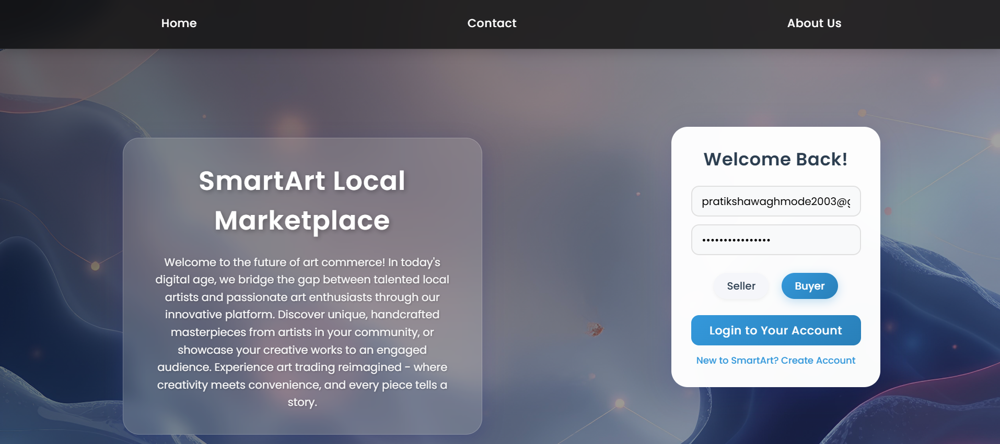
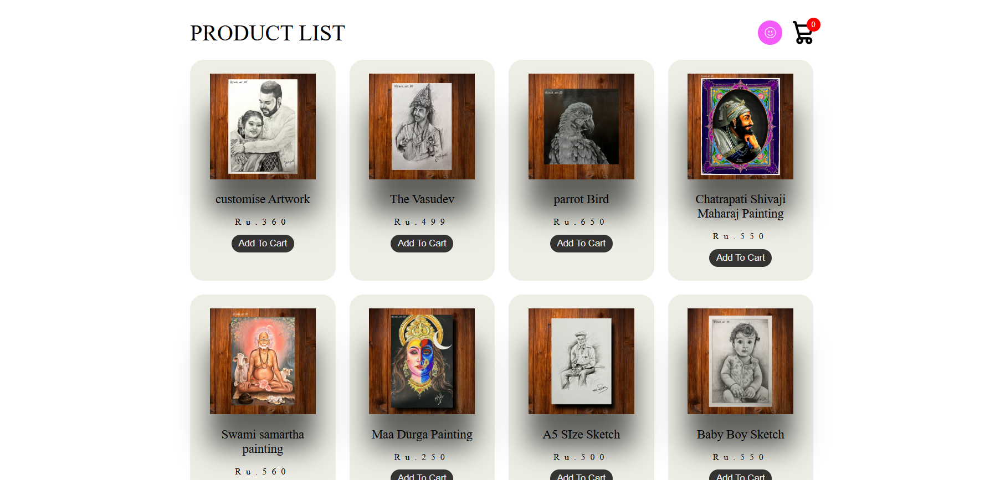
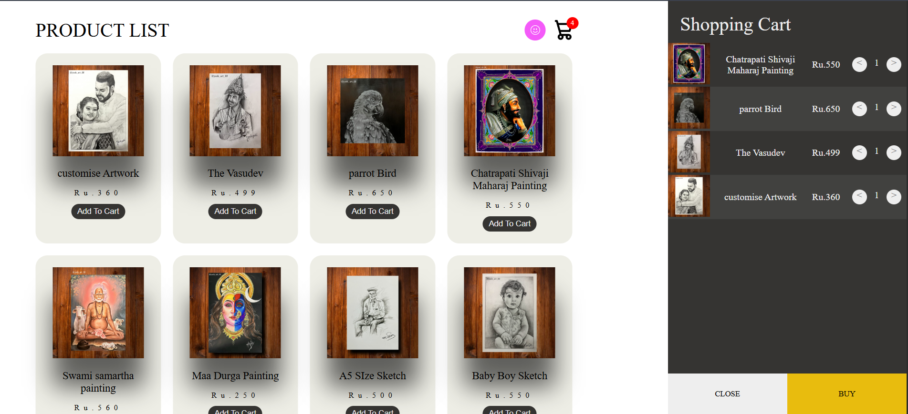
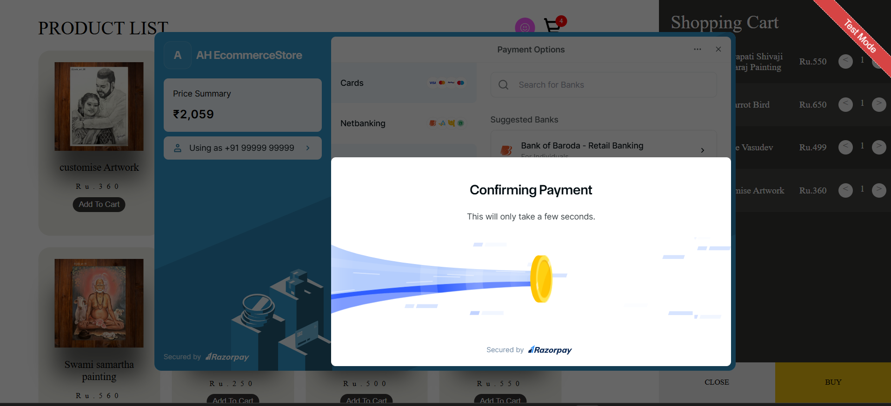
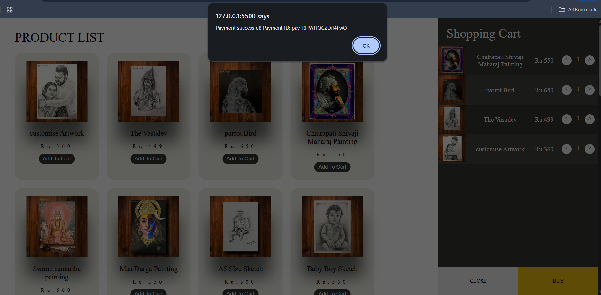
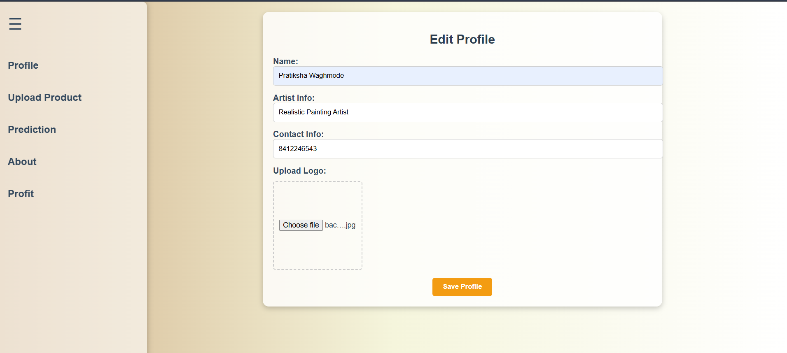
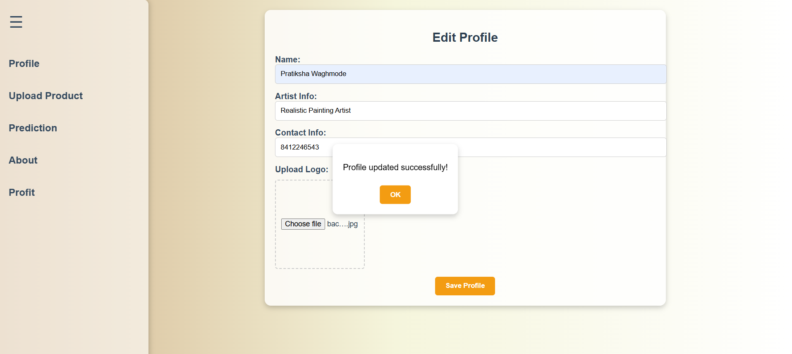

# 🖼️ SmartArt Local Marketplace

## 📌 Project Overview

SmartArt Local Marketplace is a **dynamic online marketplace** connecting local artists with consumers.
It allows users to browse products, view detailed listings, create profiles, and purchase securely.
The goal is to **support local artists** while providing customers with a seamless and responsive shopping experience.

---

## 🚀 Features

* 👤 **User Profiles** – Artists & buyers can create and manage accounts.
* 🛒 **Product Listings** – High-quality images and detailed descriptions of artworks.
* 💳 **Secure Checkout** – Integrated shopping cart and payment API for transactions.
* 📱 **Responsive Design** – Optimized for desktop and mobile.
* 🔍 **Search & Filter** – Easily find products based on category or price.

---

## 🛠️ Tech Stack

* **Frontend:** HTML, CSS, JavaScript
* **Backend:** Python
* **Styling Frameworks:** Bootstrap (if used)
* **APIs:** Payment API integration
* **Tools:** Git, GitHub, VS Code

---

## 📂 Project Structure

```
SmartArt-Marketplace/
│── index.html
│── styles.css
│── script.js
│── backend/ (Python files)
│── assets/ (images, icons)
│    ├── SmartArt_1.png
│    ├── SmartArt_2.png
│    ├── SmartArt_3.png
│    ├── SmartArt_4.png
│    ├── SmartArt_5.png
│    ├── SmartArt_6.png
│    └── SmartArt_7.png
│── README.md
```

---

## ⚙️ Installation & Setup

1. Clone the repository:

   ```bash
   git clone https://github.com/PratikshaWaghmode/SmartArt-Marketplace.git
   cd SmartArt-Marketplace
   ```
2. Open `index.html` in your browser to view the frontend.
3. Run backend (Python server):

   ```bash
   python app.py
   ```

---

## 📸 Screenshots

* **SmartArt\_1**
  

* **SmartArt\_2**
  

* **SmartArt\_3**
  

* **SmartArt\_4**
  

* **SmartArt\_5**
  

* **SmartArt\_6**
  

* **SmartArt\_7**
  

---

## 📊 Future Enhancements

* 🤖 Add **AI-based product recommendations**
* 🌍 Multi-language support
* 📱 Mobile app integration

---

## 👩‍💻 Author

**Pratiksha Waghmode**

* 🌐 [GitHub](https://github.com/PratikshaWaghmode)
* 💼 [LinkedIn](http://www.linkedin.com/in/pratikshawaghmode)
* ✉️ [Email](mailto:pratikshawaghmode2003@gmail.com)

